# UniEventPro

UniEventPro is an Online Event Management System developed for the 2nd Year 2nd Semester ITP Module by a team of 8 members. The system is built using the MERN stack (MongoDB, ExpressJS, ReactJS, NodeJS) and utilizes TailwindCSS and MaterialUI for styling.

## Responsibilities

As a member of the development team, my primary responsibility was to implement and maintain the **Partner Management** functionality. This involved designing and developing components, forms, views, and database interactions to effectively manage volunteers, sponsors, and speakers for events.

## Partner Management

The Partner Management feature allows organizers to manage volunteers, sponsors, and speakers, while providing volunteers with various opportunities. Here's an overview of the functionality:

  
Volunteer Management 

- **Read**: View available volunteer opportunities, detailed information about specific opportunities, submitted volunteer forms, application status, and schedule/assignments.

- **Create**: Fill out a registration form to become a volunteer.

- **Update**: Modify volunteer form information.

- **Delete**: Remove volunteer form.

  
 Organizer Management 

- **Create**: Add sponsor details using a sponsor form, and add speaker details using a speaker form.

- **Read**: View registered volunteers, speakers, and sponsors, as well as event-specific volunteers in a table view. Generate reports related to partners.

- **Update**: Update sponsor details using an update form, and update the status of volunteer applications in a table.

- **Delete**: Delete partners, such as sponsors and speakers.

## Tech Stack

- MongoDB: Database to store event and partner data.
- ExpressJS: Backend framework for handling API requests.
- ReactJS: Frontend library for building user interfaces.
- NodeJS: Server-side JavaScript runtime.
- TailwindCSS: CSS framework for styling.
- MaterialUI: UI component library for React.

## Screenshots

  
Volunteer Management

  
### View Available Volunteer Opportunities

  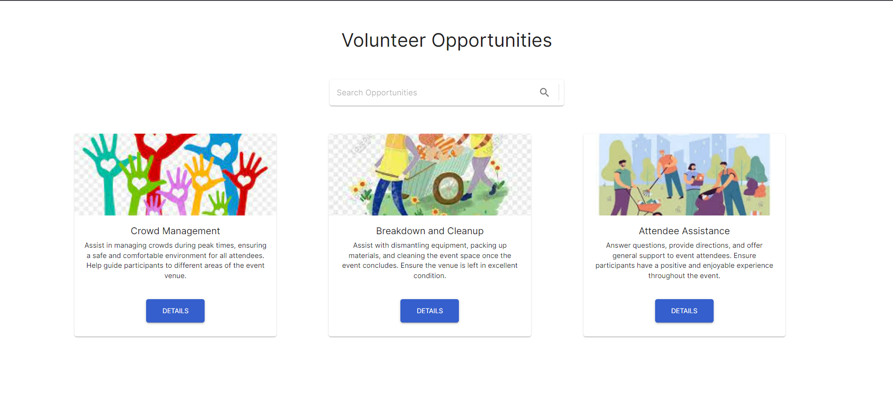

### Detailed Information about Specific Opportunities

  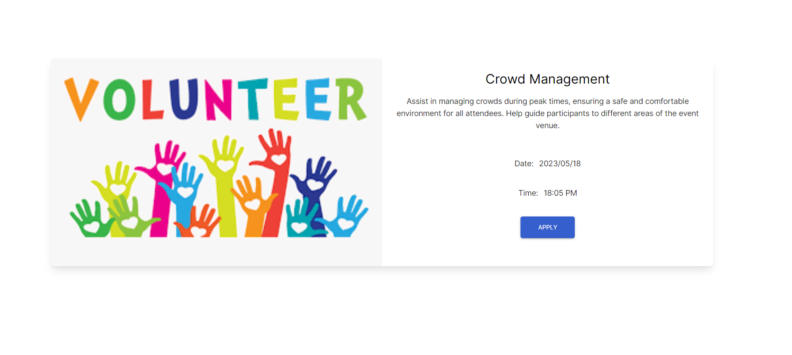

### Volunteer Registration Form

  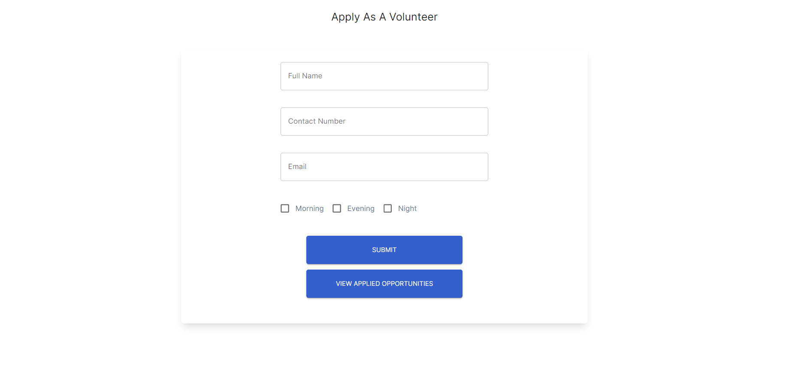

### Submitted Volunteer Forms

  

### Update Submitted Volunteer Forms

  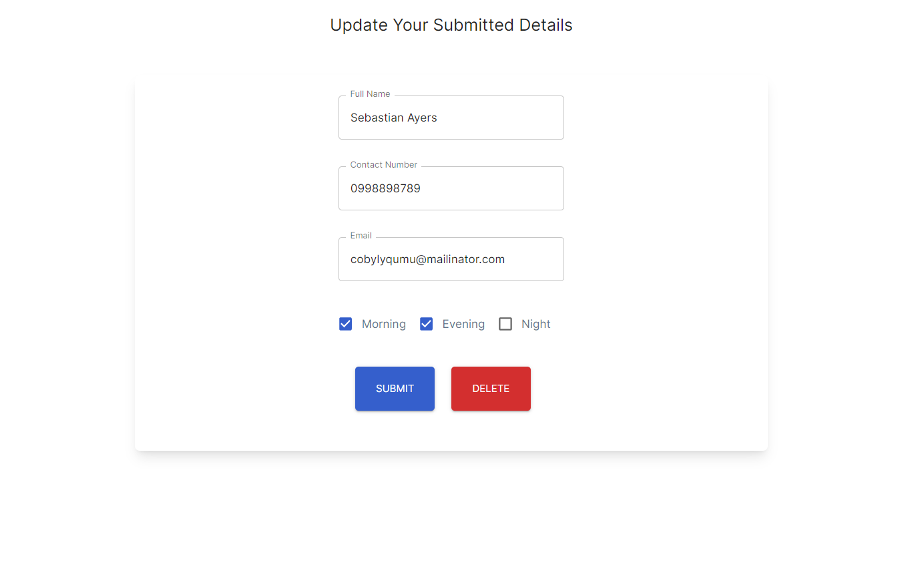

### Application Status and Schedule/Assignments

  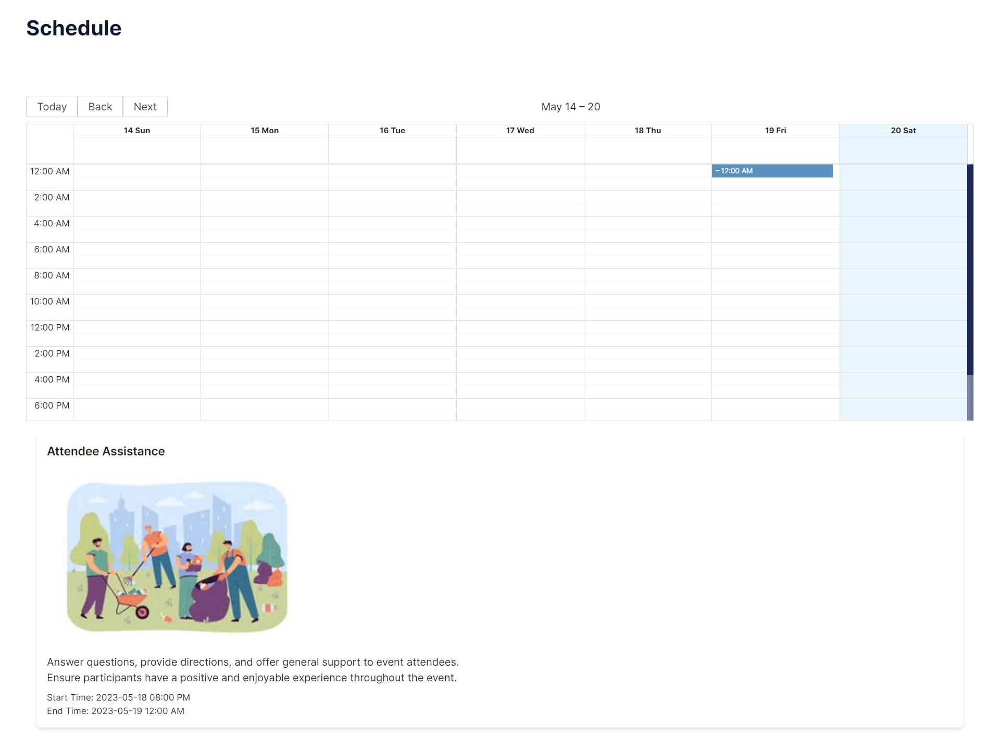

  
Organizer Management

 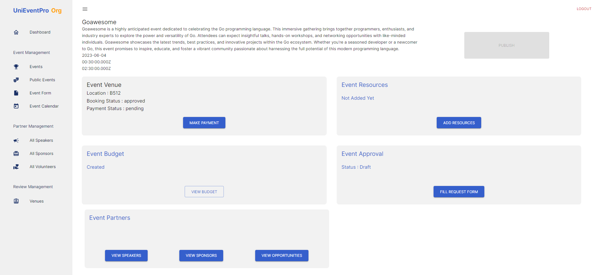

### Add Sponsor Details using Sponsor Form

  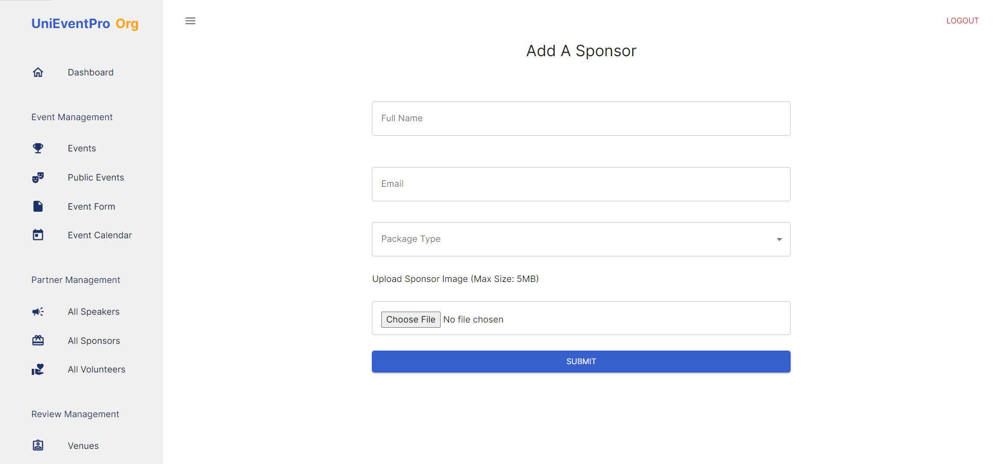

### Add Speaker Details using Speaker Form

  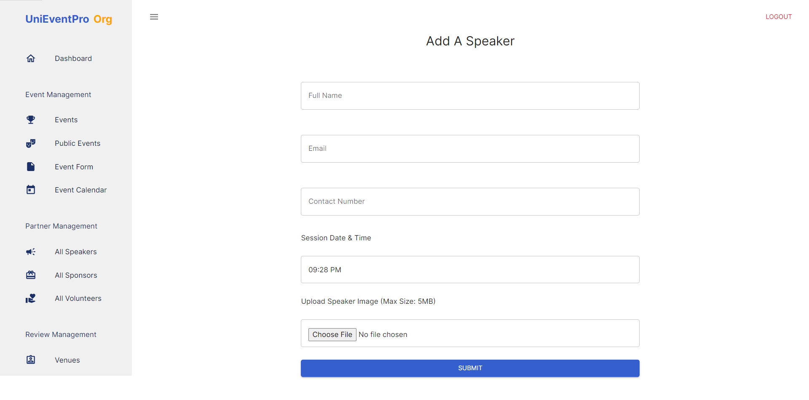

### Create Opportunities using Opportunity Form

  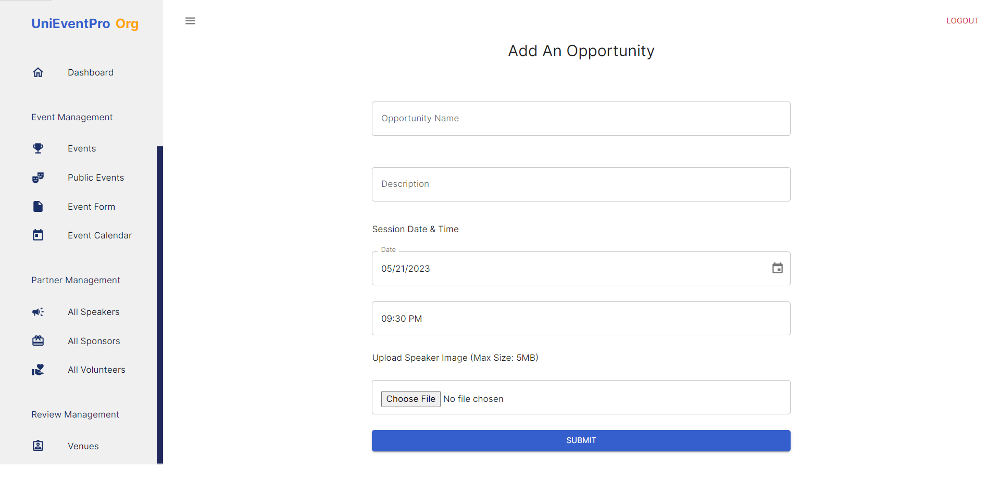

### View Event-Specific Registered Volunteers, Speakers, Sponsors and Opportunities

  
  
  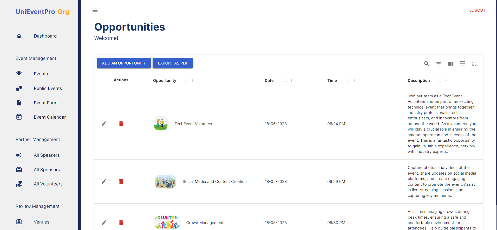
  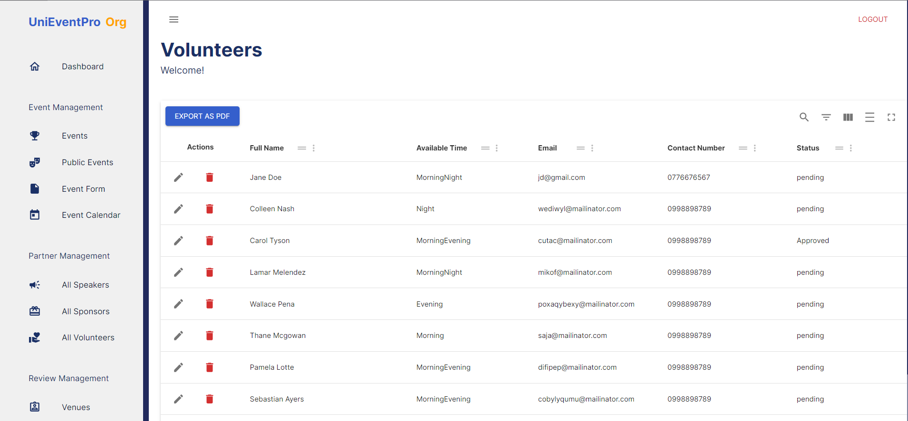
  
### Update Sponsor Details using Update Form

  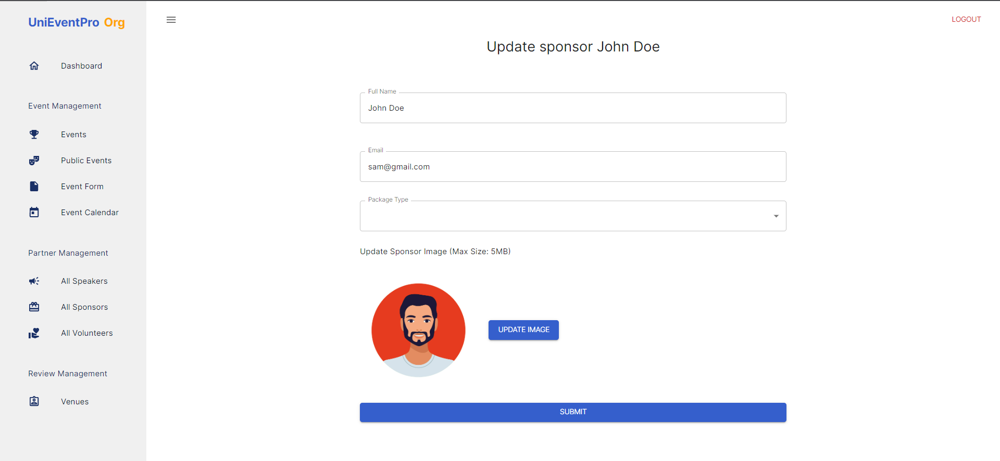

### Update Speaker Details using Update Form

  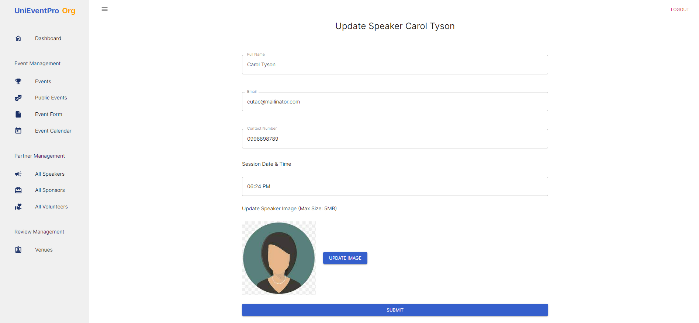

### Update Opportunity Details using Update Form

  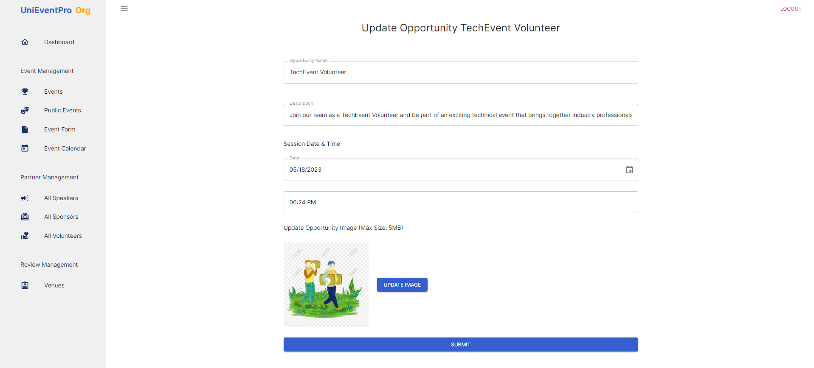

### Update the Status of Volunteer Applications in a Table

  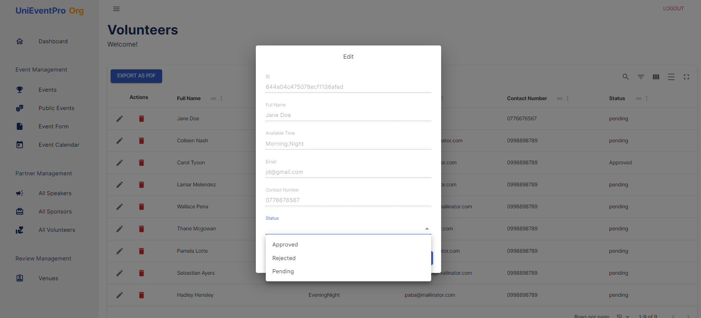

### Generate Reports related to Partners

  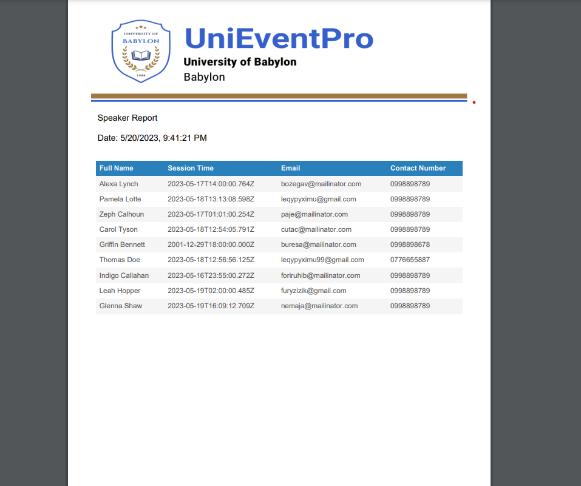

